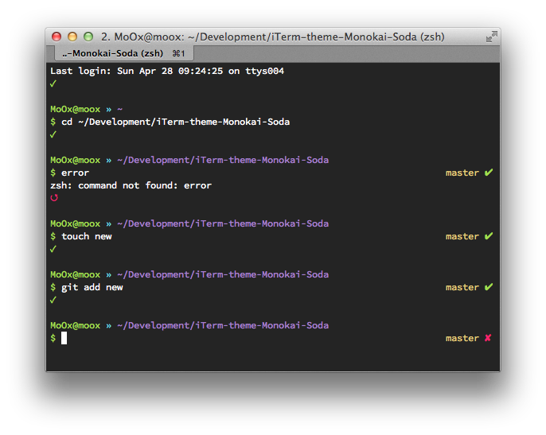
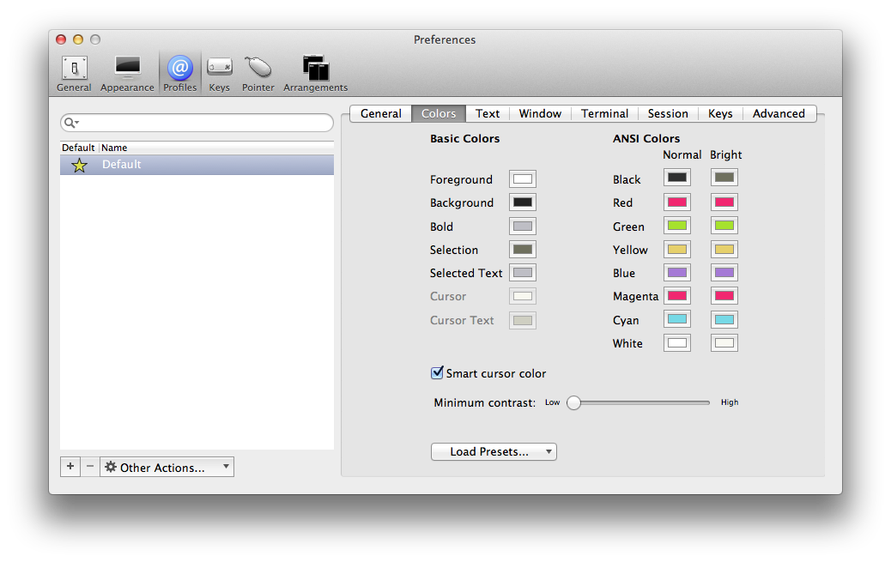
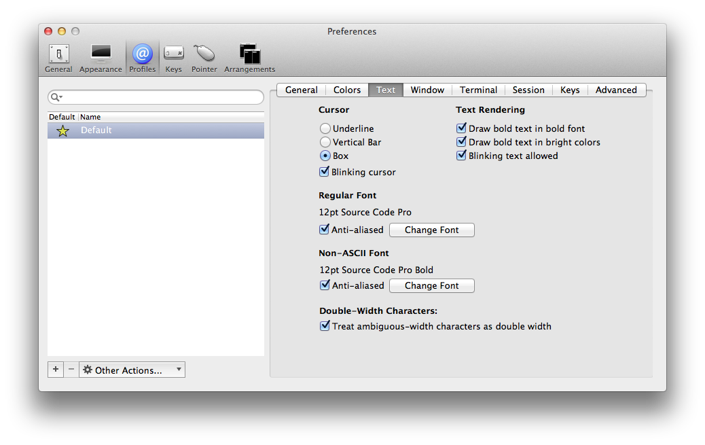

# iTerm Monokai Soda

A iTerm Monokai Soda theme, base on the [Monokai Soda color scheme](https://github.com/buymeasoda/soda-theme/#bonus-options)

## Screenshot

## Install

Import the `Monokai-Soda.itermcolors` file & load it from 

FYI, I also use this parameters

To get the exact same prompt as you see on the screenshot, you need to install [ZSH](http://www.zsh.org/) & [Oh MyZSH](https://github.com/robbyrussell/oh-my-zsh) with the theme [`moox`](https://github.com/MoOx/oh-my-zsh-more-themes#moox).

## Colors Used

    #222    background grey
    #2f3030 dark grey 
    #bebec5 light grey
    #6f705e dark grey comment 
    #76d9e6 turquoise
    #f12770 fushia
    #e6d06c yellow
    #a77afe purple
    #a6e22d green

## License

Released under [MIT Licence](http://moox.mit-license.org/)
